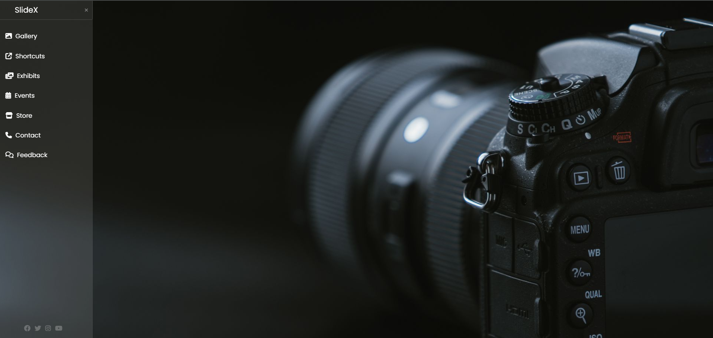

# Sidebar Navbar

A simple and responsive sidebar navigation bar built using HTML and CSS. The sidebar uses the `:checked` pseudo-class to toggle visibility and provides a smooth sliding animation.

## ✨ Features

- Responsive full-height sidebar
- Toggle open/close using checkbox + label hack
- Font Awesome icons
- Hover animations and transitions
- Poppins font and smooth UI
- Social media icons at the bottom

## 📸 Screenshot

## 📁 Files

- `index.html` – Main HTML structure
- `style.css` – CSS for styling and sidebar logic
- `photo.jpg` – Background image for the main container

